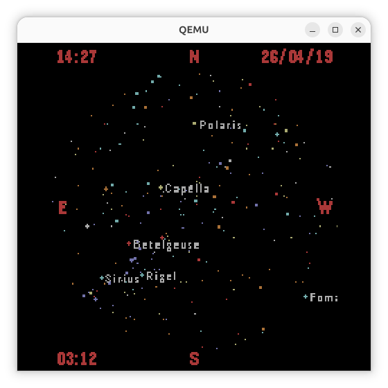

# astroface

A watchface that displays the local time (upper left), date (upper right), and apparent local sidereal time (bottom left), with a starfield calculated from the phone and sent to the watch.
Stars are colored according to their B-V index, and sizes are partitioned into three buckets with the brightest stars appearing as a +.
Updates to the star field occur every 5 minutes, while longitude updates occur every hour.
Stars brighter than magnitude 4 are displayed.

## CSV Data

Columns are:

Name, RA Hours, RA Minutes, RA Seconds, Dec Sign, Dec Degrees, Dec Minutes, Dec Seconds, Magnitude, B-V index

Hand-picked star names: Polaris, Rigel, Betelgeuse, Vega, Antares, Sirius, Capella, Fomalhaut, Spica

## Emulator workflow

1. `npm run clean`
2. `npm run build`
3. `npm run install:emery`

## Out-of-tree patch: `libpebble2` QEMU transport (no longer necessary?)

The installed `pebble-tool`'s `libpebble2/communication/transports/qemu/__init__.py` has been hand-patched so `QemuTransport.connect()` retries `[Errno 111] Connection refused` for up to 5 seconds (20 × 0.25s) instead of failing on the first try. Without this, `pypkjs` races QEMU's bind of its first `-serial tcp::PORT,server,nowait` and dies before the install reaches the watch — `pebble-tool`'s `_wait_for_qemu` only watches the *second* serial for the firmware boot banner, so by the time it spawns `pypkjs` the first port may not yet be accepting connections.

Find the patched method by grepping for `# Patched by astroface:`. **Any reinstall of `pebble-tool` (e.g., `uv tool upgrade pebble-tool`) wipes this patch — re-apply after upgrades.** The retry-loop in `npm run install:emery` is the belt to this patch's suspenders.
